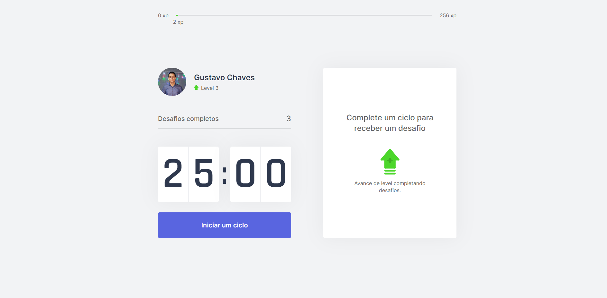

# Moveit :)

## Purpose

App made at Rocket Seat's event Next Level Week #04, which purpose is to help you to perfom and focus better on your activities, by a method that consists on a 25 minutes cycle, followed by a challenge (that can be a quickly exercise for your body or eyes).


## Getting Started

After install the necessarily packages, run the development server:

```bash
npm run dev
# or
yarn dev
```

## Main Tools
<li>ReactJs</li>
<li>NextJs</li>
<li>ContextApi</li>
<li>TypeScript</li>


