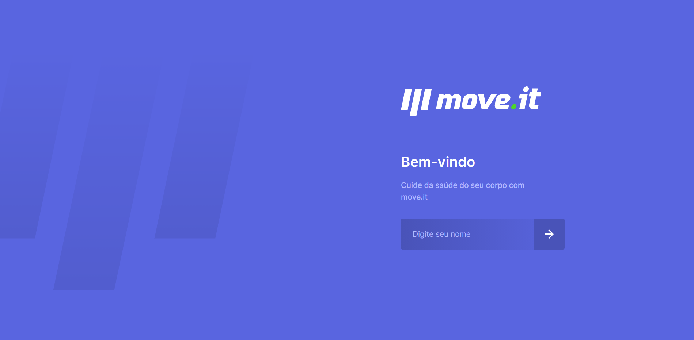
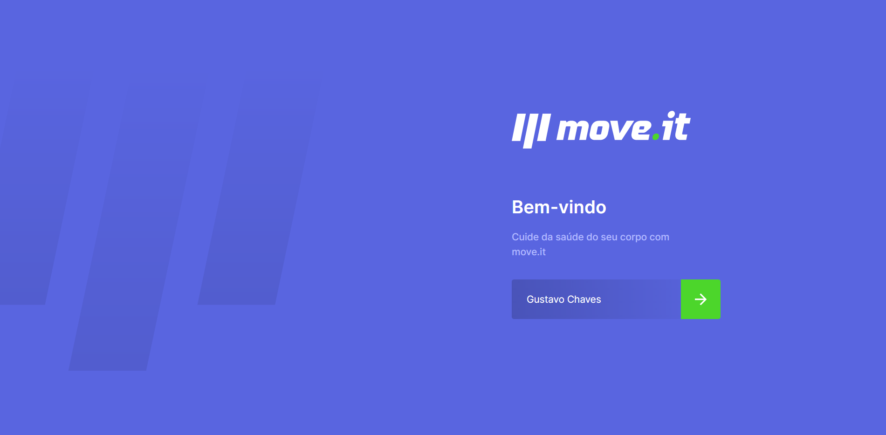
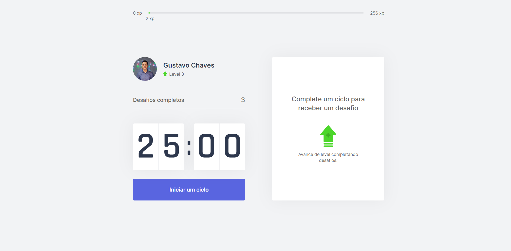

# Moveit :)

## Purpose

App made at Rocket Seat's event Next Level Week #04, which purpose is to help you to perfom and focus better on your screen activities and take care of your body health, using a method that consists on a 25 minutes cycle, followed by a challenge (that can be a quickly exercise for your body or eyes).


## Getting Started

You can use git clone to copy this repository by typing this command on your console:
`` https://github.com/gustavonikov/moveit.git ``
or you can download the zip file and open it in your IDE.

Then you run ```npm install``` if you have npm installed on your machine or ```yarn add``` if you have yarn,
to install all the dependencies that are necessarily to run the project.

After install the necessarily packages, run the development server, that by default will open on http://localhost:3000,

```bash
npm run dev
# or
yarn dev
```

## Main Tools
<li>ReactJs</li>
<li>NextJs</li>
<li>ContextApi</li>
<li>TypeScript</li>

## Features

You can start the clock to start your activity, and after 25minutes, the app will notice you and show you
a challenge, that if you did it, you can click on button 'Completei', and if you didnt click on button 'Falhei'.
If you completed the challenge, you will gain experience that will allow you to move on to the next level and so on.


<br/>




<br/>




<br/>


